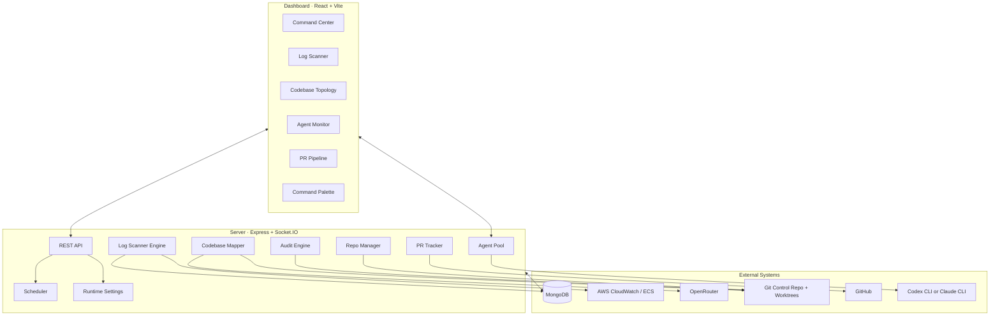
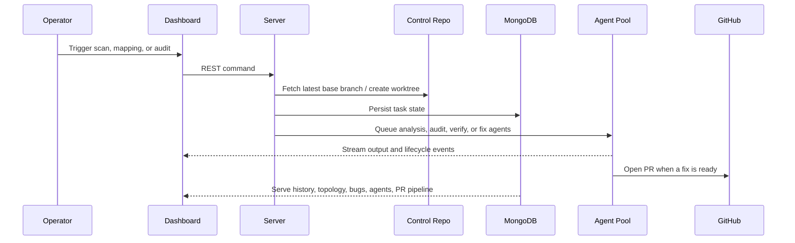

# David

<p align="left">
  <strong>Autonomous AI site reliability engineer</strong><br />
  Monitors production signals, maps a target codebase, dispatches parallel agents, and drives bugs toward pull requests from a live operator dashboard.
</p>

<p align="left">
  
  
  
  
  
</p>

<p align="left">
  <a href="#quick-start">Quick Start</a>
  ·
  <a href="#architecture">Architecture</a>
  ·
  <a href="#operator-surface">Operator Surface</a>
  ·
  <a href="#configuration">Configuration</a>
  ·
  <a href="#development">Development</a>
  ·
  <a href="#testing">Testing</a>
</p>

David is a local-first AI SRE system. It keeps a managed control clone of a target repository, ingests CloudWatch and ECS signals, builds an L1/L2/L3 topology of the codebase, runs audit and fix agents in isolated worktrees, and streams everything to a React dashboard over Socket.IO.

The result is one place to watch scans, inspect topology health, control the agent pool, switch execution backends, and track the path from bug report to merged PR.

> [!IMPORTANT]
> David operates on a remote target repository configured by `TARGET_REPO_URL`. It manages its own local control clone in `REPO_CONTROL_DIR` and creates disposable worktrees for task execution.

## Architecture



## Core Workflow



## What David Does

- Runs log scans against CloudWatch with configurable time windows and severity filters.
- Maintains persistent SRE state in MongoDB for known, active, and resolved issues.
- Builds and stores a hierarchical topology of the target repo using Gemini through OpenRouter.
- Queues audit, verification, and fix work through a managed agent pool with restarts and hard timeouts.
- Creates isolated snapshot and branch worktrees so read-only and mutating tasks do not run in the control repo itself.
- Opens and tracks GitHub pull requests tied back to bug reports and agents.
- Streams live activity, output, and high-signal events to the dashboard in real time.
- Persists operator-selected runtime settings, including the active agent backend.

## Operator Surface

| Area | Purpose |
| --- | --- |
| `Command Center` | Live operational overview with pool status, event timeline, and health widgets |
| `Log Scanner` | Trigger scans, inspect scan history, review known issues, and adjust schedules |
| `Codebase Topology` | View the treemap, inspect node health, re-map the repo, and audit selected nodes |
| `Agent Monitor` | Watch the pool in tree or timeline form and inspect individual agent output |
| `PR Pipeline` | Track bug-to-PR progression and learning metrics |
| `Global Shell` | Top bar counters, runtime backend switcher, theme toggle, command palette, ticker, and toast alerts |

> [!TIP]
> The operator shell is keyboard-friendly. `Cmd+K` / `Ctrl+K` opens a command palette for scans, audits, remapping, navigation, and global controls.

## Repository Layout

```text
.
├── dashboard/             # React 19 + Vite operator UI
├── server/                # Express API, engines, runtime, repo control, WebSocket layer
├── shared/                # Shared TypeScript contracts
├── docs/                  # Focused implementation notes
├── worktrees/             # Task worktrees created by David
├── SPEC.md                # Product and systems spec
└── .env.example           # Runtime configuration template
```

## Quick Start

### 1. Install dependencies

```bash
npm install
```

### 2. Create your local config

```bash
cp .env.example .env
```

Set the required values:

- `MONGODB_URI`
- `TARGET_REPO_URL`
- `REPO_CONTROL_DIR`
- `BASE_BRANCH`
- `GITHUB_TOKEN`
- `GITHUB_OWNER`
- `GITHUB_REPO`
- `OPENROUTER_API_KEY`

Optional but useful:

- `CLI_BACKEND`
- `CLAUDE_BINARY`
- `CODEX_BINARY`
- `MAX_CONCURRENT_AGENTS`
- `AGENT_TIMEOUT_MS`
- `AGENT_MAX_RESTARTS`

### 3. Make sure the runtime prerequisites are in place

- MongoDB is running and reachable.
- `git` is installed and the target repository is accessible via `TARGET_REPO_URL`.
- Your SSH agent or git credentials can clone and fetch the target repo.
- `REPO_CONTROL_DIR` is writable.
- AWS credentials are available for CloudWatch and ECS access.
- `codex` or `claude` is installed and available on `PATH`.

### 4. Start David

```bash
npm run dev
```

Open:

- Dashboard: `http://localhost:5173`
- API: `http://localhost:3001/api`
- Health: `http://localhost:3001/api/health`

The API starts listening immediately and returns `starting`, `ok`, or `failed` health responses while initialization completes.

## Configuration

<details>
<summary><strong>Environment variables</strong></summary>

| Variable | Purpose |
| --- | --- |
| `PORT` | Express server port, default `3001` |
| `NODE_ENV` | Runtime mode |
| `MONGODB_URI` | MongoDB connection string |
| `TARGET_REPO_URL` | Remote git repository David manages and audits |
| `REPO_CONTROL_DIR` | Local control clone directory used for fetches and worktree creation |
| `BASE_BRANCH` | Remote base branch for scans, audits, worktrees, and PRs |
| `AWS_REGION` | AWS region for CloudWatch and ECS queries |
| `CLOUDWATCH_LOG_GROUP` | CloudWatch Logs group used by the log scanner |
| `ECS_CLUSTER_NAME` | ECS cluster for runtime context |
| `ECS_SERVICE_NAME` | ECS service for runtime context |
| `GITHUB_TOKEN` | Token used for PR creation and PR tracking |
| `GITHUB_OWNER` | Target GitHub owner |
| `GITHUB_REPO` | Target GitHub repository |
| `OPENROUTER_API_KEY` | Required for topology mapping |
| `CLI_BACKEND` | Initial backend seed: `codex` or `claude` |
| `CLAUDE_BINARY` | Optional override for the Claude CLI binary |
| `CODEX_BINARY` | Optional override for the Codex CLI binary |
| `MAX_CONCURRENT_AGENTS` | Pool capacity, default `30` |
| `AGENT_TIMEOUT_MS` | Per-agent hard timeout |
| `AGENT_MAX_RESTARTS` | Restart limit per agent |

</details>

> [!NOTE]
> Runtime backend selection is persisted in MongoDB and can be changed live from the dashboard header. `CLI_BACKEND` sets the initial value when the runtime settings document is created.

## Runtime Model

### Repository management

- David keeps a managed control clone under `REPO_CONTROL_DIR`.
- Mapping and log-analysis tasks use detached snapshot worktrees.
- Fix and audit tasks use named branch worktrees under `worktrees/`.
- Startup verifies the repo, fetches the base branch, and cleans up orphaned worktrees.

### Agent execution

- The agent pool emits queued, started, completed, failed, and streamed output events.
- Execution backend can be switched between Codex and Claude without changing the dashboard contract.
- Agent output is persisted and broadcast over Socket.IO to any watching clients.

### Scheduling and tracking

- Log scans and codebase audits are scheduled by the server and can be controlled from the UI.
- Open PRs are polled and reflected back into the dashboard as merged or closed events.
- Activity history is replayed to reconnecting clients so the UI can catch up cleanly.

## API Overview

| Endpoint group | Description |
| --- | --- |
| `/api/health` | Startup-aware health endpoint |
| `/api/state` | SRE state, overview stats, and runtime settings |
| `/api/scans` | Scan triggers, history, schedules, and bug reports |
| `/api/topology` | Latest topology, remapping, and targeted audits |
| `/api/agents` | Pool status, agent records, output logs, and stop actions |
| `/api/prs` | PR records, pipeline data, and learning metrics |

## Development

```bash
# root
npm run dev
npm run build
npm test
npm run test:coverage

# server
cd server && npm run dev
cd server && npm run build
cd server && npm run test

# dashboard
cd dashboard && npm run dev
cd dashboard && npm run build
cd dashboard && npm run test
```

The root `build` script compiles `shared`, then `server`, then `dashboard`.

## Testing

David now ships with a workspace test harness built on Vitest.

```bash
# full workspace suite
npm test

# generate coverage reports
npm run test:coverage

# focused runs
npm run test:server
npm run test:dashboard
npx tsc -p dashboard/tsconfig.test.json --noEmit
```

What the harness covers:

- `server/` runs in a Node environment with router integration tests, in-memory MongoDB, and temp git remotes/worktrees for repository lifecycle coverage.
- `dashboard/` runs in `jsdom` with focused tests around the API client and Socket.IO hooks.
- Coverage reports are written to `coverage/server/` and `coverage/dashboard/`.

What it does not cover yet:

- Real AWS, OpenRouter, GitHub, or CLI backend integrations.
- Full browser end-to-end dashboard flows.

## Notes

- The Vite dev server proxies both `/api` and `/socket.io` to `localhost:3001`.
- Topology mapping uses OpenRouter-hosted Gemini models.
- PR creation depends on both local git state and GitHub permissions.
- If the control repo cannot be cloned or fetched, startup fails by design.
- Backend-specific implementation notes live in [`docs/codex-backend-support.md`](docs/codex-backend-support.md).

## License

No license file is currently included in this repository.
