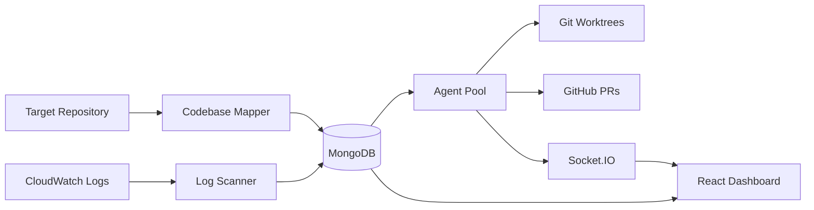
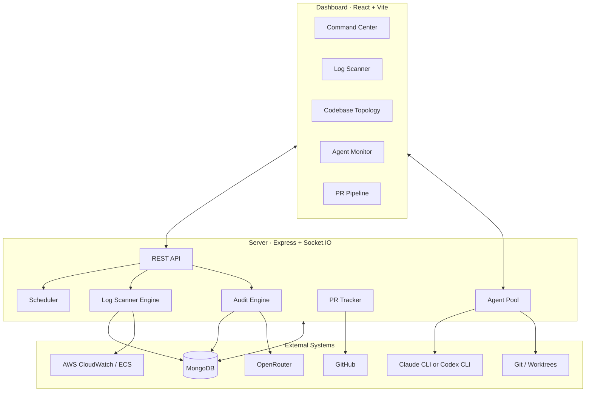
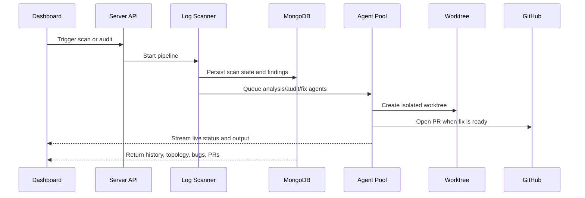

# David

<p align="left">
  <strong>Autonomous AI Site Reliability Engineer</strong><br />
  Continuously scans production signals, maps the codebase, dispatches agents, and opens PRs from a live operator dashboard.
</p>

<p align="left">
  
  
  
  
  
</p>

David is an AI-native SRE workbench built to monitor a target repository, analyze production log signals, audit the codebase in parallel, and manage the path from bug report to pull request.

It is designed for local-first operation: one Express server, one React dashboard, MongoDB for state, spawned CLI agents for execution, and Git worktrees for isolated fixes.

> [!NOTE]
> David does not monitor itself. It monitors a separate target repository configured via `TARGET_REPO_URL`, maintains a managed local control clone, and creates isolated worktrees from `origin/<BASE_BRANCH>`.

## What It Does

- Scans CloudWatch logs and stores structured scan results in MongoDB.
- Maintains persistent SRE state for known, new, updated, and resolved issues.
- Builds an L1/L2/L3 codebase topology using Gemini via OpenRouter.
- Dispatches audit and fix agents through a managed pool with queueing, restarts, and timeouts.
- Streams live agent activity to the dashboard over Socket.IO.
- Creates GitHub pull requests from dedicated worktrees and tracks them through merge or closure.

## System View



## Dashboard Surface

| Area | Purpose |
| --- | --- |
| `Command Center` | High-level operational overview with pool status, event timeline, and health vitals |
| `Log Scanner` | On-demand and scheduled scans, heatmap timeline, and scan history |
| `Codebase Topology` | Treemap-style codebase map with mapping and targeted audit triggers |
| `Agent Monitor` | Real-time tree/timeline views of active and historical agents |
| `PR Pipeline` | Kanban-style bug-to-merge workflow with learning metrics |

## Architecture



## Repository Layout

```text
.
├── dashboard/   # React 19 + Vite operator UI
├── server/      # Express API, engines, agent runtime, WebSocket layer
├── shared/      # Shared TypeScript types
├── docs/        # Focused implementation notes
├── worktrees/   # Git worktrees created for fix and audit runs
├── SPEC.md      # Product and architecture spec
└── .env.example # Runtime configuration template
```

## Quick Start

### 1. Install dependencies

```bash
npm install
```

### 2. Create your local config

```bash
cp .env.example .env
```

Update at least:

- `MONGODB_URI`
- `TARGET_REPO_URL`
- `REPO_CONTROL_DIR`
- `BASE_BRANCH`
- `GITHUB_TOKEN`
- `GITHUB_OWNER`
- `GITHUB_REPO`
- `OPENROUTER_API_KEY`
- `CLI_BACKEND` if you want `codex` instead of the default `claude`

### 3. Make sure the runtime dependencies exist

- MongoDB is running and reachable.
- The target repository is reachable at `TARGET_REPO_URL`.
- `REPO_CONTROL_DIR` is writable by the server process.
- AWS credentials are available for CloudWatch and ECS access.
- `claude` or `codex` is installed and available on your `PATH`.
- The configured base branch exists remotely on `origin`.

### 4. Start the app

```bash
npm run dev
```

Then open:

- Dashboard: `http://localhost:5173`
- API: `http://localhost:3001/api`
- Health check: `http://localhost:3001/api/health`

> [!TIP]
> The Vite dev server already proxies `/api` and `/socket.io` to `localhost:3001`, so you only need to start the root dev command.

## Environment Reference

<details>
<summary><strong>Core variables</strong></summary>

| Variable | Purpose |
| --- | --- |
| `PORT` | Express server port, default `3001` |
| `MONGODB_URI` | MongoDB connection string |
| `TARGET_REPO_URL` | Remote Git repository David audits and patches |
| `REPO_CONTROL_DIR` | Local control clone directory David manages for fetches and worktrees |
| `BASE_BRANCH` | Branch used as the worktree and PR base |
| `AWS_REGION` | AWS region for CloudWatch and ECS |
| `CLOUDWATCH_LOG_GROUP` | CloudWatch Logs group for scans |
| `ECS_CLUSTER_NAME` | ECS cluster name for operational context |
| `ECS_SERVICE_NAME` | ECS service name for operational context |
| `GITHUB_TOKEN` | Token used for PR creation and PR tracking |
| `GITHUB_OWNER` | Target GitHub org or user |
| `GITHUB_REPO` | Target GitHub repository |
| `OPENROUTER_API_KEY` | Required for codebase mapping |
| `CLI_BACKEND` | `claude` or `codex` |
| `CLAUDE_BINARY` | Optional override for the Claude CLI binary |
| `CODEX_BINARY` | Optional override for the Codex CLI binary |
| `MAX_CONCURRENT_AGENTS` | Agent pool size, default `30` |
| `AGENT_TIMEOUT_MS` | Per-agent hard timeout |
| `AGENT_MAX_RESTARTS` | Restart limit per agent |

</details>

## Operational Flow



## API Surface

| Endpoint group | Description |
| --- | --- |
| `/api/state` | SRE state and overview data |
| `/api/scans` | Trigger scans, inspect history, update schedules, list bugs |
| `/api/topology` | Fetch topology, remap codebase, launch audits |
| `/api/agents` | Inspect pool state, fetch output, stop agents |
| `/api/prs` | PR listing, pipeline data, learning metrics |

## Development Commands

```bash
# root
npm run dev
npm run build

# server
cd server && npm run dev
cd server && npm run build

# dashboard
cd dashboard && npm run dev
cd dashboard && npm run build
```

## Implementation Notes

- The server starts by cleaning up orphaned agent processes and stale worktrees.
- Agent output is persisted and streamed in real time over Socket.IO.
- David keeps its own local control clone and creates task worktrees under `worktrees/` from `origin/<BASE_BRANCH>`.
- The dashboard is a first-class operator surface, not an afterthought layered on logs.
- Backend switching between Claude and Codex is documented in [`docs/codex-backend-support.md`](docs/codex-backend-support.md).

> [!WARNING]
> `TARGET_REPO_URL` is required. If David cannot clone or fetch the target repository, startup fails.

## Read Before Running In Earnest

- This project assumes meaningful access to production-adjacent systems: logs, GitHub, and a writable local control clone directory for the target repo.
- PR creation depends on both local git state and GitHub API permissions.
- Codebase mapping depends on OpenRouter access.
- Scan quality depends on the configured CloudWatch log group and the AWS credentials available to the server process.

## License

No license file is currently included in this repository.
